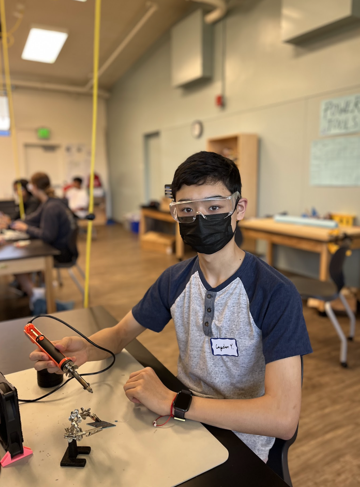
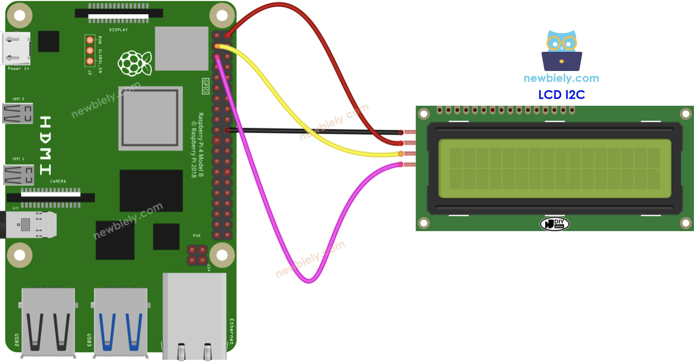
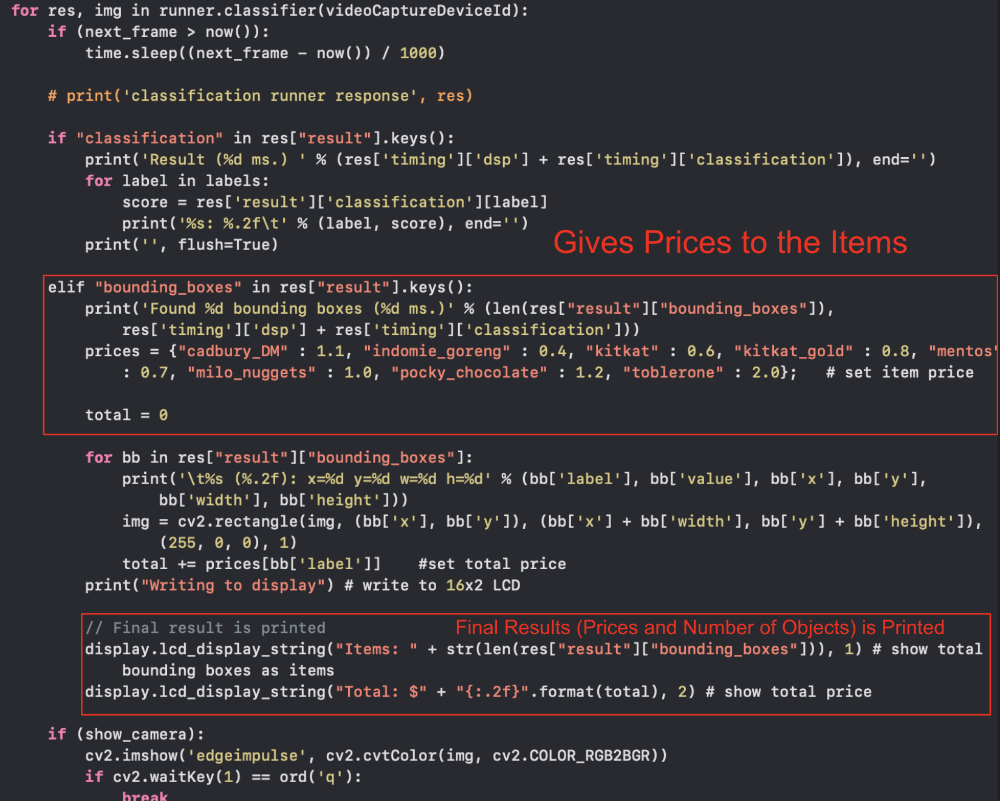
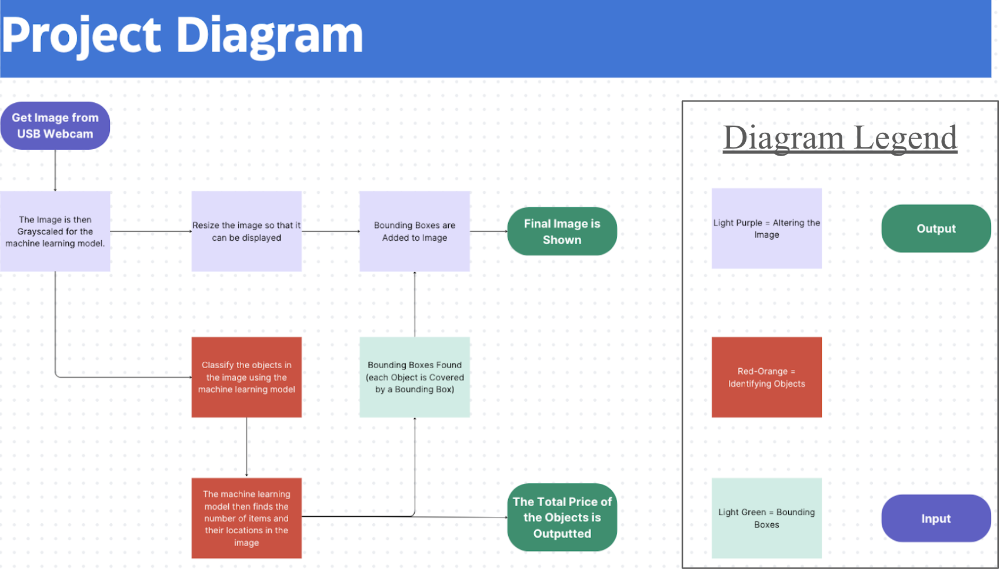
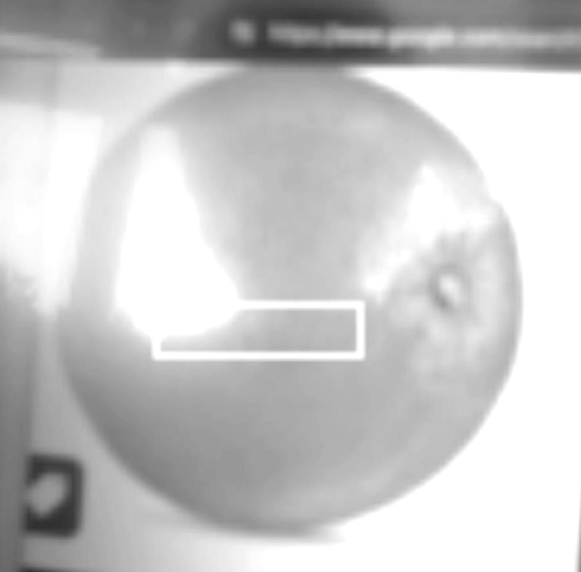
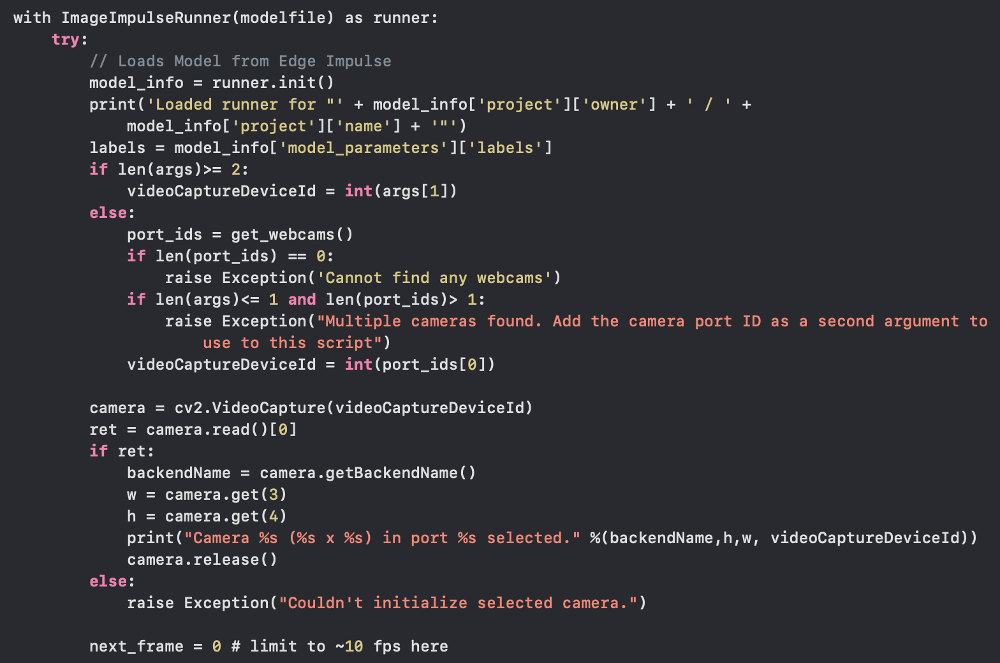
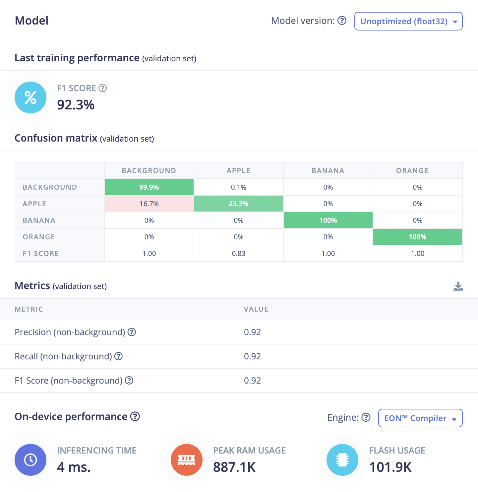
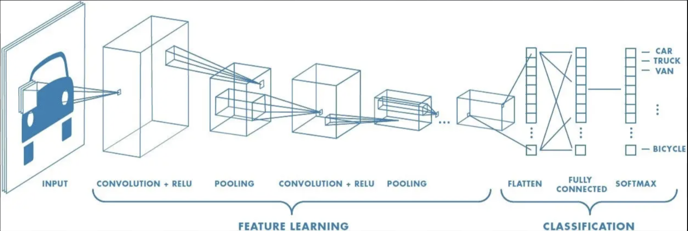
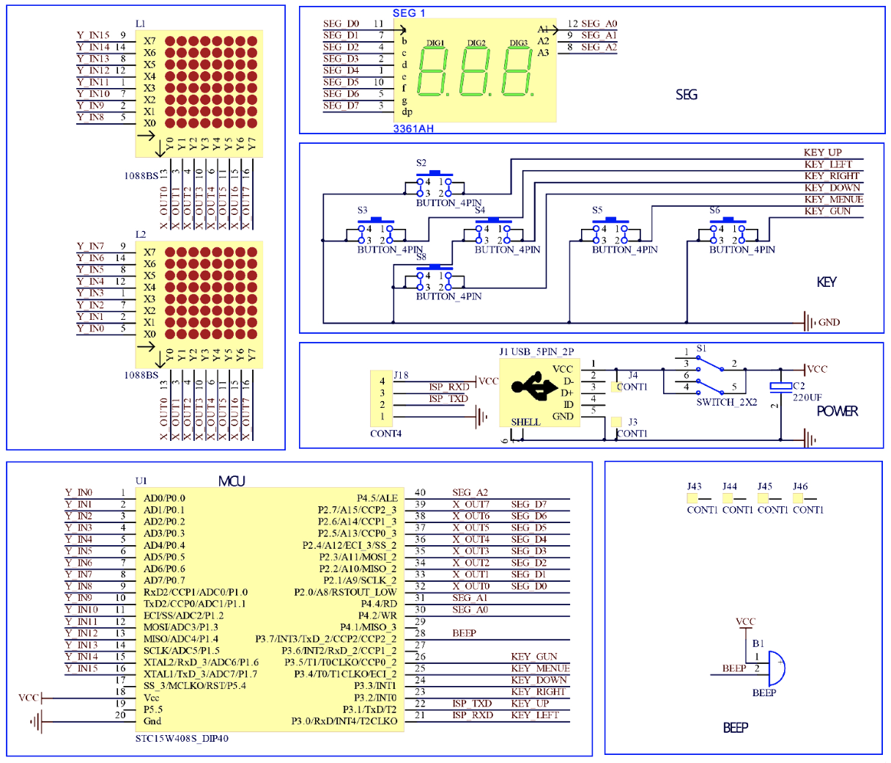
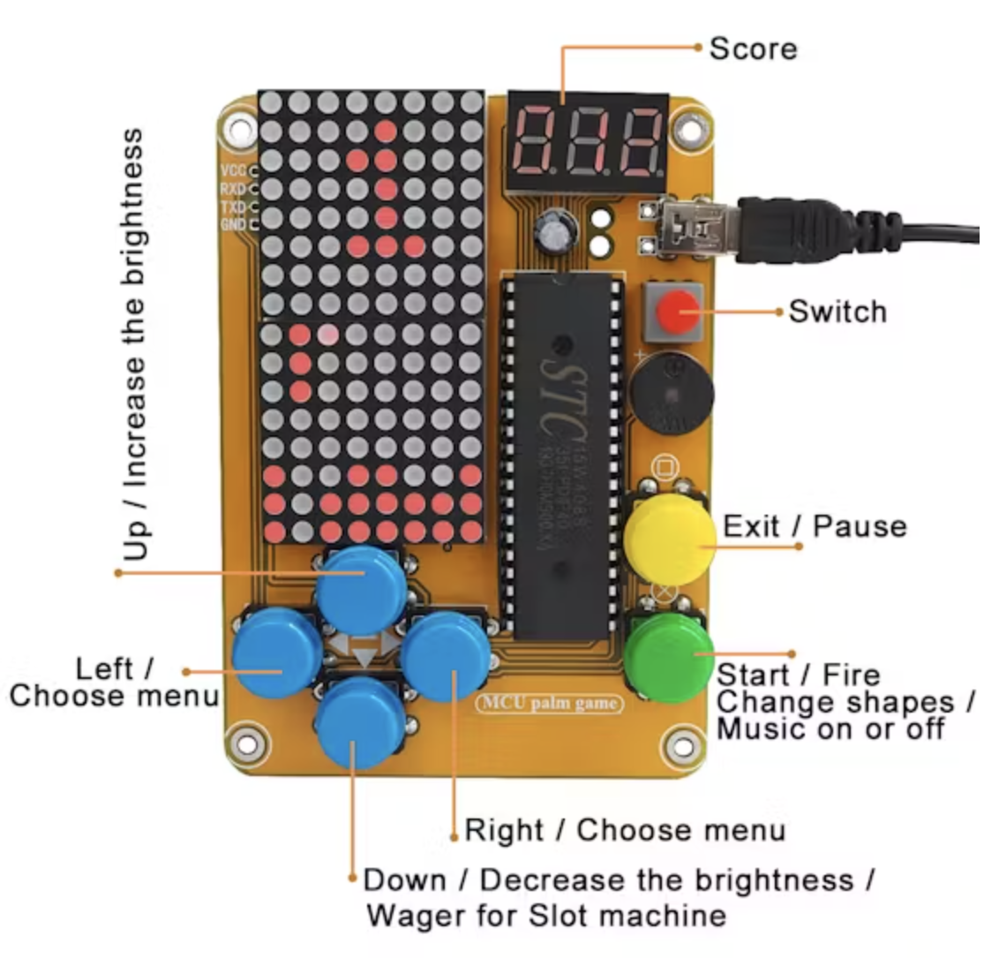

# BlueStamp Smart Cashier
The project I chose uses a Raspberry Pi 4 Model B board as the main component. This is essentially the computer that stores the code for the project. My code is a machine learning model that is trained to identify common grocery objects (e.g. snacks and fruits) and puts a price on them. A small camera on the device inputs an image of some items and the AI will then identify what object(s) it is and output the price and the number of items identified.

<!---
You should comment out all portions of your portfolio that you have not completed yet, as well as any instructions:
```HTML
<!--- This is an HTML comment in Markdown -->
<!--- Anything between these symbols will not render on the published site
```
-->

| **Engineer** | **School** | **Area of Interest** | **Grade** |
|:--:|:--:|:--:|:--:|
| Cayden Y | Saratoga High School | Physics/Chemistry | Incoming Junior |



# Final Milestone: Adding an LCD Display to the Raspberry Pi

**Don't forget to replace the text below with the embedding for your milestone video. Go to Youtube, click Share -> Embed, and copy and paste the code to replace what's below.**

<iframe width="560" height="315" src="https://www.youtube.com/embed/F7M7imOVGug" title="YouTube video player" frameborder="0" allow="accelerometer; autoplay; clipboard-write; encrypted-media; gyroscope; picture-in-picture; web-share" allowfullscreen></iframe>

**How it Works:**
For my third milestone I added an LCD display that shows the output from my code, which would be the number of items and the total price of those items so that I wouldn’t have to look at my monitor to see the outputs. This is done by printing to my LCD display instead of the terminal, allowing me to see the outputs on a more visible screen.
Figure: A Snippet of the Python Code that Prints the Final Result



Figure: LCD and Raspberry Pi Schematic

**Challenges/Complications:**
Coding:
Although my third milestone was pretty simple compared to my first and second milestones, I still faced a few issues when trying to run code that is compatible with the LCD display. For example, I had not initialized (assigned) anything to the term “display”, leading to an error that I had trouble fixing. Another error I had was due to the fact that I had not downloaded the i2c_lcd library needed to run the function after I initialized the term “display”. 



Figure: A Snippet of the Python Code that Prints the Final Result

# Second Milestone: Connecting Edge Impulse to the Raspberry Pi

<iframe width="560" height="315" src="https://www.youtube.com/embed/wltxmrRWUFI?si=Jxk9RcX9DfNHqTx0" title="YouTube video player" frameborder="0" allow="accelerometer; autoplay; clipboard-write; encrypted-media; gyroscope; picture-in-picture; web-share" referrerpolicy="strict-origin-when-cross-origin" allowfullscreen></iframe>

**How it Works:**
For my second milestone, I connected a Raspberry Pi to my machine learning model to identify objects in an image and label the total price of the objects. Specifically, I run Python code from the terminal that allows me to run my Edge Impulse machine learning model. This code runs in real time with data from a USB camera that I have connected to my Raspberry Pi. Depending on what and how many items are identified using the machine learning model, the code will then output the number of valid items and the total price. For this milestone, I used apples and oranges as the valid items.



Figure: Flowchart of Smart Cashier



Figure: Bounding Boxes show that there is an Orange there

Python Code:
With the code that I have, I am able to run my Edge Impulse machine learning model all within Python. This allows me to output any desired outcomes, which in this case would be the number of items identified and the price that I have given the objects. The Python code also allows me to display the live stream from my USB Camera including the bounding boxes that show the locations of the objects.



Figure: A Snippet of the Python Code that Runs the Machine Learning Model

**Challenges/Complications:**
Downloading:
In order to successfully run my code on the Raspberry Pi, I had to download various libraries that allow certain functions to work in coding. I faced many errors as I was missing some libraries – such as RPi.GPIO and cv2 – that I needed for my code to work. What was difficult about downloading libraries was that I had to go through different processes depending on what library I wanted to download and it was difficult to find instructions on how to do that. Additionally, the connection between my computer and Raspberry Pi was very weak because of the adapter. This meant that I would sometimes have to reboot the Raspberry Pi so that I could continue working.

# First Milestone: My Machine Learning Model

<iframe width="560" height="315" src="https://www.youtube.com/embed/_pOxtSg9z3A?si=IJSKAmeDeWUueTH-" title="YouTube video player" frameborder="0" allow="accelerometer; autoplay; clipboard-write; encrypted-media; gyroscope; picture-in-picture; web-share" referrerpolicy="strict-origin-when-cross-origin" allowfullscreen></iframe>

**How it Works:**
On the Edge Impulse platform, I feed various images of common grocery list items such as fruits and snacks into a convolutional neural network (CNN), which is a type of machine learning program made for processing images. The neural network will then train and test on the data I have provided in order to accurately identify where and what grocery items I will provide so that it can identify and price the objects in a much more efficient way compared to conventional methods of checking out groceries.



Figure 4: Precision score for my machine learning model

Neural Network: A neural network is a form of artificial intelligence that mimics the human brain in order to process data. This type of artificial intelligence uses various hidden layers and nodes in order to process the given data and output a desired result. 



Figure 3: Example of the architecture of a machine learning model

<a href="https://saturncloud.io/blog/a-comprehensive-guide-to-convolutional-neural-networks-the-eli5-way/"> Link to Image of Machine Learning Model Example </a>

**Challenges/Complications:**
Data Acquisition:
When data is extremely varied, a lot of data is needed in order to create an accurate model. When I was collecting data, I also collected drawings of the grocery items as well as photos. This change in style made it difficult for the machine learning model to correctly identify those drawings. In order to fix this, I had to remove those drawings and also add more photos in order to make an accurate model. Since adding more data can be extremely meticulous and slow, it was pretty difficult to increase the precision of my machine learning model. 

Changing Parameters (Ablation):
I also had to change the parameters for my machine learning model many times (known as ablation). Each time I change a parameter, it takes up to five minutes for those new parameters to be applied to the model as the training process takes a while, making this process extremely slow as well.

**What's Next:**
I will be working on my Raspberry Pi, which is what will hold my machine learning model and extra code that a write. It will also have a display to show the number of items and the total price.

# Retro Arcade Console

<iframe width="560" height="315" src="https://www.youtube.com/embed/4vww2JQ0xkE?si=JVcywouwzf4S4CA3" title="YouTube video player" frameborder="0" allow="accelerometer; autoplay; clipboard-write; encrypted-media; gyroscope; picture-in-picture; web-share" referrerpolicy="strict-origin-when-cross-origin" allowfullscreen></iframe>

**Parts:**
1 Buzzer, 1 Electric Capacitor, 1 Micro USB, 1 Power Cable, 1 Self-switch, 1 Self-switch Cap, 1 Digitron display, 1 IC Chip, 2 LED Dot Matrix Modules, 6 Buttons, 6 Button Caps, 1 PCB, 8 3x5mm Screws, 2 3x8mm Screws, 4 Double-pass Copper Columns, 4 Single-head Hexagonal Columns, 1 AAA Battery Case, 6 Acrylic Shells

**How it Works:**
The retro arcade processor, which is powered via three AAA batteries, uses a microprocessor that takes the inputs from the six different buttons/switches, processes them, and then instructs the LED dot matrices and scoreboard to light up certain dots depending on what happens in the game and what buttons are pressed. Depending on the game, the IC chip will also tell the buzzer to create certain sound effects. Additionally, each button, dot matrix, etc. must be soldered in order to create an uninterrupted electrical current that can successfully take in or receive information.



Figure 2: Schematic of the retro arcade

<a href="https://www.hackster.io/lewisdiy/build-your-own-game-console-kit-play-the-classic-games-5ca95f"> Link to Schematic </a>

**The Buttons:**
A button is a special type of switch with two modes: on and off. A button will stay in one mode, such as on/off, until pushed: which is when the button provides a momentary electrical signal. This makes buttons much more useful compared to switches in cases such as typing or switching between multiple different functions (such as for changing the strength of an LED light bulb).



Figure 1: Image of the components of the retro arcade

<a href="https://www.hackster.io/lewisdiy/build-your-own-game-console-kit-play-the-classic-games-5ca95f"> Link to Image of Retro Arcade Console </a>

**Challenges/Complications:**
One reason soldering was a complication for me was because there were many small wires that needed to be soldered to the PCB board. As a result, this task was extremely time consuming. Another reason soldering was a problem was because each wire required proper soldering in order to be able to send an electrical current. Because of this, everything that had too little  solder or solder that was applied incorrectly did not work. For example, I did not add enough solder to my dot matrix, therefore, my LED dot matrices were not lighting up when they  should have.

<!---
# Code
Here's where you'll put your code. The syntax below places it into a block of code. Follow the guide [here]([url](https://www.markdownguide.org/extended-syntax/)) to learn how to customize it to your project needs.

```c++
void setup() {
  // put your setup code here, to run once:
  Serial.begin(9600);
  Serial.println("Hello World!");
}

void loop() {
  // put your main code here, to run repeatedly:

}
```
-->
# Bill of Materials
Here's where you'll list the parts in your project. To add more rows, just copy and paste the example rows below.
Don't forget to place the link of where to buy each component inside the quotation marks in the corresponding row after href =. Follow the guide [here]([url](https://www.markdownguide.org/extended-syntax/)) to learn how to customize this to your project needs. 

| **Part** | **Note** | **Price** | **Link** |
|:--:|:--:|:--:|:--:|
| Raspberry Pi 4 Model B | Single-board Computer | $56.91 | <a href="https://www.amazon.com/Raspberry-Model-2019-Quad-Bluetooth/dp/B07TD42S27/ref=asc_df_B07TD42S27/?tag=hyprod-20&linkCode=df0&hvadid=692875362841&hvpos=&hvnetw=g&hvrand=3073603301731430935&hvpone=&hvptwo=&hvqmt=&hvdev=c&hvdvcmdl=&hvlocint=&hvlocphy=9032183&hvtargid=pla-2281435178858&mcid=f46e152b627438ccb7bf2e8b73945a50&hvocijid=3073603301731430935-B07TD42S27-&hvexpln=73&gad_source=1&th=1"> Link </a> |
| USB Webcam | Provides images | $Price | <a href="https://www.amazon.com/Arduino-A000066-ARDUINO-UNO-R3/dp/B008GRTSV6/"> Link </a> |
| LCD Display 16x2 | Displays the output | $Price | <a href="https://www.amazon.com/Arduino-A000066-ARDUINO-UNO-R3/dp/B008GRTSV6/"> Link </a> |

<!---# Other Resources/Examples
One of the best parts about Github is that you can view how other people set up their own work. Here are some past BSE portfolios that are awesome examples. You can view how they set up their portfolio, and you can view their index.md files to understand how they implemented different portfolio components.
- [Example 1](https://trashytuber.github.io/YimingJiaBlueStamp/)
- [Example 2](https://sviatil0.github.io/Sviatoslav_BSE/)
- [Example 3](https://arneshkumar.github.io/arneshbluestamp/)

To watch the BSE tutorial on how to create a portfolio, click here.
-->

