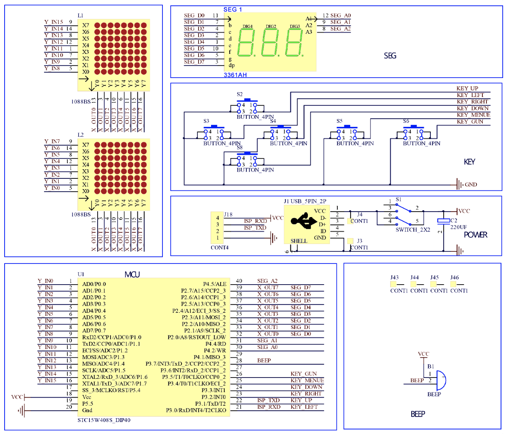

# BlueStamp Smart Cashier
The project I chose uses a Raspberry Pi 4 Model B board as they main component. This is essentially the computer that stores the code for the project. My code is a machine learning model that is trained to identify common grocery objects (e.g. snacks and fruits) and puts a price on them. A small camera on the device inputs an image of some items and the AI will then identify what object(s) it is and output the price and the number of items identified.

<!---
You should comment out all portions of your portfolio that you have not completed yet, as well as any instructions:
```HTML
<!--- This is an HTML comment in Markdown -->
<!--- Anything between these symbols will not render on the published site
```
-->

| **Engineer** | **School** | **Area of Interest** | **Grade** |
|:--:|:--:|:--:|:--:|
| Cayden Y | Saratoga High School | Physics/Chemistry | Incoming Junior |


<!---# Final Milestone

**Don't forget to replace the text below with the embedding for your milestone video. Go to Youtube, click Share -> Embed, and copy and paste the code to replace what's below.**

<iframe width="560" height="315" src="https://www.youtube.com/embed/F7M7imOVGug" title="YouTube video player" frameborder="0" allow="accelerometer; autoplay; clipboard-write; encrypted-media; gyroscope; picture-in-picture; web-share" allowfullscreen></iframe>

For your final milestone, explain the outcome of your project. Key details to include are:
- What you've accomplished since your previous milestone
- What your biggest challenges and triumphs were at BSE
- A summary of key topics you learned about
- What you hope to learn in the future after everything you've learned at BSE-->


<!--# Second Milestone

**Don't forget to replace the text below with the embedding for your milestone video. Go to Youtube, click Share -> Embed, and copy and paste the code to replace what's below.**

<iframe width="560" height="315" src="https://www.youtube.com/embed/y3VAmNlER5Y" title="YouTube video player" frameborder="0" allow="accelerometer; autoplay; clipboard-write; encrypted-media; gyroscope; picture-in-picture; web-share" allowfullscreen></iframe>

For your second milestone, explain what you've worked on since your previous milestone. You can highlight:
- Technical details of what you've accomplished and how they contribute to the final goal
- What has been surprising about the project so far
- Previous challenges you faced that you overcame
- What needs to be completed before your final milestone-->

# First Milestone: My Machine Learning Model

<iframe width="560" height="315" src="https://www.youtube.com/embed/_pOxtSg9z3A?si=IJSKAmeDeWUueTH-" title="YouTube video player" frameborder="0" allow="accelerometer; autoplay; clipboard-write; encrypted-media; gyroscope; picture-in-picture; web-share" referrerpolicy="strict-origin-when-cross-origin" allowfullscreen></iframe>

**How it Works:**
On the Edge Impulse platform, I feed various images of common grocery list items such as fruits and snacks into a convolutional neural network (CNN), which is a type of machine learning program made for processing images. The neural network will then train and test on the data I have provided in order to accurately identify where and what grocery items I will provide so that it can identify and price the objects in a much more efficient way compared to conventional methods of checking out groceries.


Neural Network: A neural network is a form of artificial intelligence that mimics the human brain in order to process data. This type of artificial intelligence uses various hidden layers and nodes in order to process the given data and output a desired result. 


**Challenges/Complications:**
Data Acquisition:
When data is extremely varied, a lot of data is needed in order to create an accurate model. When I was collecting data, I also collected drawings of the grocery items as well as photos. This change in style made it difficult for the machine learning model to correctly identify those drawings. In order to fix this, I had to remove those drawings and also add more photos in order to make an accurate model. Since adding more data can be extremely meticulous and slow, it was pretty difficult to increase the precision of my machine learning model. 

Changing Parameters (Ablation):
I also had to change the parameters for my machine learning model many times (known as ablation). Each time I change a parameter, it takes up to five minutes for those new parameters to be applied to the model as the training process takes a while, making this process exremely slow as well.

**What's Next:**
I will be working on my Raspberry Pi, which is what will hold my machine learning model and extra code that a write. It will also have a display to show the number of items and the total price.

# Retro Arcade Console

<iframe width="560" height="315" src="https://www.youtube.com/embed/4vww2JQ0xkE?si=JVcywouwzf4S4CA3" title="YouTube video player" frameborder="0" allow="accelerometer; autoplay; clipboard-write; encrypted-media; gyroscope; picture-in-picture; web-share" referrerpolicy="strict-origin-when-cross-origin" allowfullscreen></iframe>

**Parts:**
1 Buzzer, 1 Electric Capacitor, 1 Micro USB, 1 Power Cable, 1 Self-switch, 1 Self-switch Cap, 1 Digitron display, 1 IC Chip, 2 LED Dot Matrix Modules, 6 Buttons, 6 Button Caps, 1 PCB, 8 3x5mm Screws, 2 3x8mm Screws, 4 Double-pass Copper Columns, 4 Single-head Hexagonal Columns, 1 AAA Battery Case, 6 Acrylic Shells

**How it Works:**
The retro arcade processor, which is powered via three AAA batteries, uses a microprocessor that takes the inputs from the six different buttons/switches, processes them, and then instructs the LED dot matrices and scoreboard to light up certain dots depending on what happens in the game and what buttons are pressed. Depending on the game, the IC chip will also tell the buzzer to create certain sound effects. Additionally, each button, dot matrix, etc. must be soldered in order to create an uninterrupted electrical current that can successfully take in or receive information.



**The Buttons:**
A button is a special type of switch with two modes: on and off. A button will stay in one mode, such as on/off, until pushed: which is when the button provides a momentary electrical signal. This makes buttons much more useful compared to switches in cases such as typing or switching between multiple different functions (such as for changing the strength of an LED light bulb).


**Challenges/Complications:**
One reason soldering was a complication for me was because there were many small wires that needed to be soldered to the PCB board. As a result, this task was extremely time consuming. Another reason soldering was a problem was because each wire required proper soldering in order to be able to send an electrical current. Because of this, everything that had too little  solder or solder that was applied incorrectly did not work. For example, I did not add enough solder to my dot matrix, therefore, my LED dot matrices were not lighting up when they  should have.

<!---# Code
Here's where you'll put your code. The syntax below places it into a block of code. Follow the guide [here]([url](https://www.markdownguide.org/extended-syntax/)) to learn how to customize it to your project needs.

```c++
void setup() {
  // put your setup code here, to run once:
  Serial.begin(9600);
  Serial.println("Hello World!");
}

void loop() {
  // put your main code here, to run repeatedly:

}
```

# Bill of Materials
Here's where you'll list the parts in your project. To add more rows, just copy and paste the example rows below.
Don't forget to place the link of where to buy each component inside the quotation marks in the corresponding row after href =. Follow the guide [here]([url](https://www.markdownguide.org/extended-syntax/)) to learn how to customize this to your project needs. 

| **Part** | **Note** | **Price** | **Link** |
|:--:|:--:|:--:|:--:|
| Item Name | What the item is used for | $Price | <a href="https://www.amazon.com/Arduino-A000066-ARDUINO-UNO-R3/dp/B008GRTSV6/"> Link </a> |
| Item Name | What the item is used for | $Price | <a href="https://www.amazon.com/Arduino-A000066-ARDUINO-UNO-R3/dp/B008GRTSV6/"> Link </a> |
| Item Name | What the item is used for | $Price | <a href="https://www.amazon.com/Arduino-A000066-ARDUINO-UNO-R3/dp/B008GRTSV6/"> Link </a> |

# Other Resources/Examples
One of the best parts about Github is that you can view how other people set up their own work. Here are some past BSE portfolios that are awesome examples. You can view how they set up their portfolio, and you can view their index.md files to understand how they implemented different portfolio components.
- [Example 1](https://trashytuber.github.io/YimingJiaBlueStamp/)
- [Example 2](https://sviatil0.github.io/Sviatoslav_BSE/)
- [Example 3](https://arneshkumar.github.io/arneshbluestamp/)

To watch the BSE tutorial on how to create a portfolio, click here.
